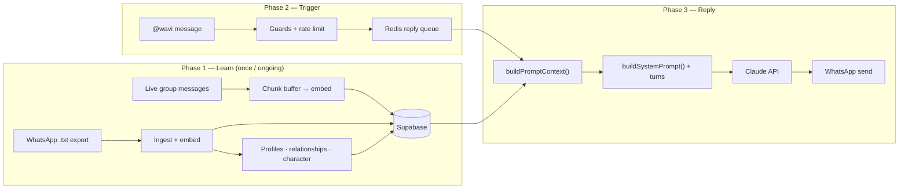
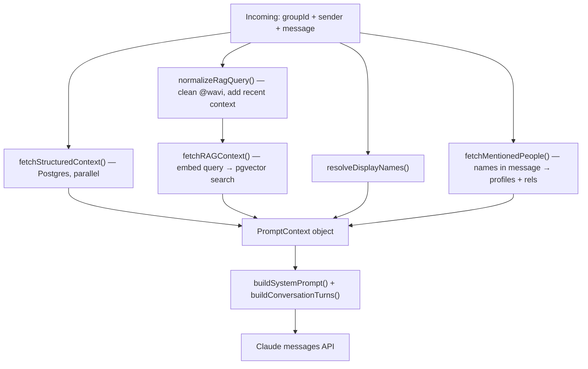
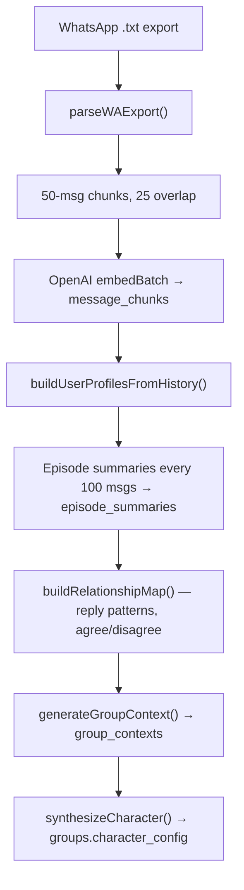

# How Wavi Works

Wavi is a **group-aware AI member** for WhatsApp. Before it ever replies, it **reads and analyzes the group's history** (export + live messages). When someone tags `@wavi`, it **assembles a rich context prompt** and asks Claude to reply **in character** — like a friend who knows everyone, not a generic bot.

**Replay** (`bun run replay`) is the **offline debugger** for that exact same reply path — it shows you the full prompt and Claude's answer **without sending anything to WhatsApp**.

---

## The Big Picture (3 phases)



| Phase       | What happens                                                                                                               |
| ----------- | -------------------------------------------------------------------------------------------------------------------------- |
| **Learn**   | History is chunked, embedded (pgvector), and analyzed into profiles, relationships, summaries, and a synthesized character |
| **Trigger** | Someone tags Wavi → message stored → guards checked → job queued                                                           |
| **Reply**   | Context assembled from DB + RAG → system prompt built → Claude replies → sent to group                                     |

---

## Easy Flow: What Happens When Someone Tags Wavi

```
1. Message arrives in WhatsApp group
2. Saved to `messages` table + added to chunk buffer (for future RAG)
3. Is @wavi tagged?  →  No: stop (but message is still stored)
4. Special commands? (remember / alias / reminder)  →  handle directly, stop
5. Guards: bot-loop, rate limit, jailbreak/code abuse  →  maybe deflect, stop
6. Job pushed to Redis queue
7. Worker picks up job → buildPromptContext() → Claude → send reply
8. Reply saved; worker watches for negative reactions (recovery)
```

The handler lives in `apps/api/src/whatsapp/handlers.ts`; the worker in `apps/api/src/ai/worker.ts`.

---

## What Is Replay?

**Replay is not a separate AI path.** It runs the **same code** as production replies:

- Imports `buildPromptContext`, `buildSystemPrompt`, `buildConversationTurns` from `apps/api/src/ai/prompt.js`
- Calls `buildPromptContext({ groupId, senderWaId, currentMessage })` — identical to live replies

Then it prints:

1. **System prompt** (all blocks — identity, character, RAG, etc.)
2. **Conversation turns** (last ~20 messages as user/assistant messages)
3. **Claude's reply** (unless `skipClaude` or no API key)

### How to run it

```bash
# Fixture cases from replay-fixtures.json
bun run replay -- --fixtures

# One-off test against a real group in your DB
bun run replay -- <groupId> --sender "Yoni Cohen" --message "@wavi מי זה Dan Cohen? וואו"
```

**Requires:** `SUPABASE_URL`, `SUPABASE_SERVICE_ROLE_KEY`, and `ANTHROPIC_API_KEY` in `apps/api/.env`. The group must already have ingested data.

**Replay vs live:** Replay skips WhatsApp, Redis queue, guards, rate limits, and delivery. It goes straight to `buildPromptContext` → Claude — so you see **exactly what the model sees**.

---

## What Wavi Analyzes Before a Reply (or Replay)

Everything funnels through **`buildPromptContext()`** in `apps/api/src/ai/prompt.ts`. This runs **at reply time** (live or replay).

### Step-by-step at reply time



### The 3 context layers

| Layer                       | Source                                                                                                  | Always / on-demand                        |
| --------------------------- | ------------------------------------------------------------------------------------------------------- | ----------------------------------------- |
| **Layer 1 — Structured DB** | Character, sender profile, relationships, memories, last 20 msgs                                        | Always (Postgres queries)                 |
| **Layer 2 — RAG**           | Up to 5 message chunks + up to 3 episode summaries (similarity ≥ 0.35, deduped against recent messages) | Per message (vector search)               |
| **Layer 3 — Summaries**     | Group context summary, behavioral summaries                                                             | Pre-computed at ingest; loaded in Layer 1 |

### What each fetch returns

**`fetchStructuredContext`** — 6 parallel DB queries:

| Data                 | Table / source     | Purpose                               |
| -------------------- | ------------------ | ------------------------------------- |
| Character + language | `groups`           | Voice, opinions, sliders, reply model |
| Sender profile       | `user_profiles`    | Who is asking — tone, traits, aliases |
| Top 3 relationships  | `relationship_map` | Narratives involving the sender       |
| Group memories       | `group_memories`   | `@wavi remember …` facts              |
| Rolling summary      | `group_contexts`   | "What's been going on lately"         |
| Last 20 messages     | `messages`         | Immediate chat window                 |

**`fetchRAGContext`** — semantic search:

1. **`normalizeRagQuery`** strips `@wavi`, filler ("וואו", "hey"), and appends last 3 messages for context
2. **Embed** the query (OpenAI embeddings)
3. **`search_message_chunks`** → top 5 relevant 50-message windows
4. **`search_episode_summaries`** → top 3 episode summaries (~100-msg blocks)

**`fetchMentionedPeople`** — if the message mentions a member by name/alias:

- Load their behavioral summary
- Sensitivity flags (topics to avoid)
- Their top 2 relationship narratives

**Then `buildSystemPrompt`** turns this into **10 blocks** (identity, role boundary, character, personality sliders, group context, sender, relationships, mentioned people, memories, RAG history, format rules, language rules).

**`buildConversationTurns`** formats the last 20 messages as alternating user/assistant turns for Claude's `messages` array.

---

## What Gets Analyzed Before Wavi Goes Live (Ingestion)

This is the **offline intelligence pipeline** — run when you upload a WhatsApp export (or rebuild from stored messages). It populates everything `buildPromptContext` later reads.



| Stage                   | What it produces                                             |
| ----------------------- | ------------------------------------------------------------ |
| **Embedding**           | Searchable history chunks in pgvector                        |
| **Profiling**           | Per-member behavioral summaries, aliases, sensitivity flags  |
| **Episodes**            | Short LLM summaries of 100-message blocks (cheaper RAG hits) |
| **Relationships**       | Pair scores + narratives ("Dan and Sara often debate…")      |
| **Group context**       | Rolling "vibe of the group" summary                          |
| **Character synthesis** | Voice, opinions, signature behavior, personality sliders     |

**Ongoing (live messages):** Every message goes to a Redis chunk buffer; every 50 messages it flushes → new embeddings + optional re-profiling (`apps/api/src/jobs/chunker.ts`).

---

# Highly Detailed Section

## A. Live message path (full sequence)

### A1. Inbound handler (`handleIncomingMessage`)

1. **Filter:** group only, not agent's own message, dedup by `waMsgId` (Redis)
2. **Lookup group** — must exist and not be `paused`
3. **Insert message** into `messages`
4. **`appendToChunkBuffer`** — feeds the live embedding pipeline
5. **Mine mention aliases** — `@labels` in text → profile aliases
6. **If not tagged** → fire `checkForNegativeReaction` (text-based: "wtf wavi", "לא בסדר" etc.) and reconcile identity (export name ↔ live WA ID), then **return**
7. **Emoji reactions** (from `message_reaction` / `messages.upsert`) → `handleReaction`: 👎/😡 flags recent replies + inserts miss memory; 👍/❤️ clears the pending window
8. **If tagged:**
   - Memory commands (`remember` / `forget` / `recall`) → direct DB reply, no Claude
   - Alias commands (`@wavi alias "X" is Y`) → direct reply
   - Reminder commands (`remind me` / `תזכיר לי` / `my reminders` / `cancel reminder`) → direct DB reply, no Claude (see §G)
   - **Bot-loop guard** — skip if last 5 messages are all agent
   - **Rate limit** — 20/hour per sender (character-aware deflection)
   - **`checkInputGuard`** — block long messages, code dumps, jailbreaks (no Claude)
   - **`queueReplyJob`** → Redis `reply_jobs`

### A2. Reply worker (`processReplyJob`)

1. **Budget check** — auto-pause if monthly cap exceeded
2. **`generateReplyText`** unless retrying delivery with cached `reply_text`
3. **`deliverReply`** via WhatsApp (or Twilio for DMs)
4. **Persist** agent message + `replies` row (tokens, latency)
5. **Set `pending_reaction:*`** in Redis (2 min) for recovery monitoring
6. On delivery failure → re-queue up to 5 times with generated text preserved

### A3. Recovery (`checkForNegativeReaction` + `handleReaction`)

Two paths — both fully wired:

- **Text-based:** any non-tagged message matching negative patterns ("wtf wavi", "לא בסדר", "delete that", etc.) within 2 minutes of a reply → in-character apology sent, reply flagged `flagged_miss`, miss memory auto-inserted into `group_memories`.
- **Emoji reaction:** 👎/😡/🤮 on a message in the pending-reaction window → same outcome without a text match.
- **Positive emoji** (👍/❤️/🔥) → clears the pending window silently (reply landed well).
- **Dashboard manual flag** (`PATCH /replies/:id/flag`) → also auto-inserts a miss memory.

In all miss cases, `autoInsertMissMemory` writes a `group_memories` row so future prompts avoid similar replies.

---

## B. Prompt assembly (`PromptContext`)

The assembled context object includes:

| Field                    | Description                                |
| ------------------------ | ------------------------------------------ |
| `character_config`       | Voice, opinions, sliders, reply model      |
| `group_name`             | Group display name                         |
| `language_mode`          | `he` / `en` / `auto`                       |
| `group_context_summary`  | Rolling group vibe summary                 |
| `sender_profile`         | Who tagged Wavi                            |
| `relevant_relationships` | Top 3 relationship narratives for sender   |
| `group_memories`         | Explicit `@wavi remember` facts            |
| `mentioned_people`       | Profiles for names detected in the message |
| `rag_chunks`             | Top 5 message chunk summaries              |
| `rag_episode_summaries`  | Top 3 episode summaries                    |
| `recent_messages`        | Last 20 messages verbatim                  |
| `resolved_display_names` | wa_user_id → display name map              |
| `quoted_message`         | Optional WhatsApp quote-reply context      |
| `current_message`        | The tagged message body                    |

### B1. RAG query normalization

`normalizeRagQuery` in `prompt.ts`:

- Strips `@wavi` and numeric `@mention` IDs
- Removes filler words ("וואו", "hey", "please")
- Appends recent-message context — 1 message for short/deictic questions (≤8 words + a question word like מי/מה/מתי/where/what/when), 3 messages for longer statements — so embeddings track intent without diluting deictic queries

The **embedding query** is not the raw `@wavi` tag — it's the semantic intent plus recent thread.

### B2. System prompt blocks (`prompt-build.ts`)

| Block               | Content                                                                                                                                 |
| ------------------- | --------------------------------------------------------------------------------------------------------------------------------------- |
| 1 — Identity        | Agent name + group name                                                                                                                 |
| 2 — Role boundary   | "Group member, not dev assistant" + jailbreak refusal                                                                                   |
| 3 — Character       | `voice`, `opinions`, `signature_behavior`                                                                                               |
| 4 — Personality     | 6 sliders with interpreted labels (formality, humor, verbosity, assertiveness, empathy, emoji usage)                                    |
| 5 — Group context   | `group_context_summary`                                                                                                                 |
| 6 — Sender profile  | Display name, aliases, `behavioral_summary`, adaptive tone hints (message length, humor, formality, emoji style from `UserProfileData`) |
| 7 — Relationships   | Top 3 narratives for sender                                                                                                             |
| — Mentioned people  | Extra block if names detected in message                                                                                                |
| — Memories          | Up to 10 `group_memories`                                                                                                               |
| 8 — RAG history     | Chunk summaries + episode summaries                                                                                                     |
| — Quoted reply      | If user replied to a specific message                                                                                                   |
| — Sensitivity       | Flags for sender + mentioned people                                                                                                     |
| — Datetime          | Current time in `GROUP_TIMEZONE`                                                                                                        |
| 9 — WhatsApp format | Short, no markdown, ~280 chars default                                                                                                  |
| 10 — Language       | Hebrew/English/auto rules                                                                                                               |

### B3. Claude API call (`generate.ts`)

```typescript
anthropic.messages.create({
  model: replyModel,
  max_tokens: 500,
  system: systemPrompt,
  messages: [...conversationTurns, ...extraTurns, { role: 'user', content: `${senderName}: ${body}` }],
});
```

**Message order:** historical turns → optional extra turns → **current tagged message** as final user turn.

---

## C. Ingestion intelligence (what "analysis" means pre-live)

### C1. User profiling (`profiler.ts`)

For each active member:

- Collect their messages + messages **addressed to** them (proximity replies within 90s, name references)
- Claude (Sonnet) extracts **aliases** (nicknames, transliterations)
- Claude (Sonnet) synthesizes **behavioral_summary** (humor style, topics, tone) and structured `UserProfileData` (humor score, formality score, avg message length, emoji usage) — these fields feed the per-sender tone adaptation in Block 6
- **sensitivity_flags** (topics to avoid roasting)

### C2. Relationship map (`relationships.ts`)

For each member pair:

- **Signals:** reply counts A→B and B→A, agreement/disagreement keywords, defense patterns
- **Scores:** interaction, conflict, solidarity
- Claude writes a **narrative** prose description per pair

### C3. Character synthesis (`summarizer.ts`)

Inputs: last 10 episode summaries + all behavioral summaries  
Output: `character_config` JSON — voice, opinions, signature behavior, sliders — stored on `groups`.

### C4. Live chunker (`chunker.ts`)

After every message:

- Buffer in Redis until 50 messages
- Flush: embed full content → `message_chunks`; optional per-chunk LLM summary (set `SUMMARIZE_CHUNKS=true`; runs at ingest/rebuild only)
- Every 100 messages: new episode summary → then triggers character drift + examples capture (see §H)
- Queue **live re-profiling** for active speakers

---

## D. Replay harness internals

| Step           | What replay does                                              |
| -------------- | ------------------------------------------------------------- |
| Resolve sender | `user_profiles` by display name or `wa_user_id`               |
| Build context  | Same `buildPromptContext` as production                       |
| Print          | System prompt + turns JSON + current user turn                |
| Call Claude    | Same model as `character_config.reply_model` or default       |
| Skip Claude    | `skipClaude: true` in fixture, or missing `ANTHROPIC_API_KEY` |

**Fixtures** (`apps/api/scripts/replay-fixtures.json`) pin real `groupId` values from a dev DB — swap for your own group's UUID.

---

## E. Mental model: three clocks

| Clock             | When                                       | What runs                                                                          |
| ----------------- | ------------------------------------------ | ---------------------------------------------------------------------------------- |
| **Slow clock**    | Export upload, rebuild, every 50 live msgs | Embed, profile, relationships, summaries, character                                |
| **Fast clock**    | Every `@wavi` tag                          | Parallel Postgres + one embed + vector search → prompt → Claude (~2–10s)           |
| **Feedback loop** | Every reaction / every ~100 live msgs      | Flags misses → auto-memory, character slider drift, voice example capture (Sonnet) |

**Replay** only exercises the **fast clock**, assuming the **slow clock** already ran.

---

## F. One concrete example

**User:** `@wavi מי זה Dan Cohen? וואו` from Yoni Cohen

| Step       | What Wavi does                                                                                                                            |
| ---------- | ----------------------------------------------------------------------------------------------------------------------------------------- | ------------------------------------------------- |
| RAG query  | Strips `@wavi` + `וואו` → detects deictic ("מי זה Dan Cohen?"), prepends only the single most-recent message as anchor → embeds `"Sara: … | מי זה Dan Cohen?"` (only 1 anchor message, not 3) |
| Structured | Loads Yoni's profile, his top relationships, group character (Hebrew casual), last 20 msgs                                                |
| Mentioned  | Detects "Dan Cohen" → loads Dan's behavioral summary + relationships + sensitivity                                                        |
| RAG        | Finds chunks/episodes where Dan appears                                                                                                   |
| Prompt     | 10-block system prompt + conversation history                                                                                             |
| Claude     | Short in-character Hebrew answer about Dan                                                                                                |

Run `bun run replay -- --fixtures` with your env to see the **exact** prompt for that case.

---

## G. Reminders

Wavi supports scheduled reminders set directly in the group chat. Unlike AI replies, reminders are **command-handled synchronously** — no Claude call, no Redis queue.

### G1. How a reminder is set

```
Member: "@wavi remind me at 16 to leave"
        "@wavi תזכיר לי בעוד 20 דקות לצאת"

  ▼ resolveReminderCommand()          (apps/api/src/lib/reminder-handler.ts)
  │  detectReminderCommand() matches the trigger phrase
  │  parseReminderInput() extracts the time expression via regex
  │    EN patterns: "in N min/hr/day", "at HH[:MM] [am/pm]", "at 16", "tomorrow [at …]"
  │    HE patterns: "בעוד N דקות/שעות/ימים", "בשעה HH", "ב-16", "מחר [ב-…]", "חצי שעה", …
  │  Returns: { fireAt: Date, reminderText: "leave" }
  │
  ▼ INSERT INTO reminders
      group_id      ← which group (UUID)
      wa_group_id   ← WA group JID ("123@g.us") — delivery address
      sender_wa_id  ← who asked
      sender_name   ← display name for the reminder message
      reminder_text ← "leave"
      fire_at       ← absolute UTC timestamp
      sent_at       ← NULL (not yet fired)

  ▼ Wavi replies: "⏰ Got it! I'll remind you "leave" in 5h 8m"
```

**10-reminder cap:** if the sender already has 10 pending reminders, the oldest is auto-deleted and the user is told which one was dropped. They are never blocked from setting a new one.

### G2. How a reminder fires — no DB triggers

The `reminders` table is **passive**. Nothing in Postgres fires automatically. Delivery is handled by a polling loop started at server boot alongside the reply worker:

```
apps/api/src/jobs/reminder-worker.ts
  startReminderWorker()
    └── while(true):
          SELECT * FROM reminders
            WHERE fire_at <= now()
            AND sent_at IS NULL        ← partial index keeps this fast
          → for each row:
              sendReply(wa_group_id, "⏰ {sender_name}, reminder: {text}")
              UPDATE reminders SET sent_at = now()
          sleep(60 000ms)
```

The worker wakes every **60 seconds**. Max delivery lag is ±60 s.

```
Railway process (always running)
  ├── Fastify HTTP server
  ├── startReplyWorker()        ← AI replies via Claude
  └── startReminderWorker()     ← reminder delivery, polls Supabase every 60s
```

### G3. Other reminder commands

| Trigger                              | Action                                             |
| ------------------------------------ | -------------------------------------------------- |
| `my reminders` / `התזכורות שלי`      | List all pending reminders for that sender         |
| `cancel reminder X` / `בטל תזכורת X` | Delete the first reminder matching text fragment X |

### G4. Dashboard & test chat

- **Reminders view** (`/reminders`): lists all pending reminders across all groups. Each row has an **edit** button (opens inline form to change text and/or time) and a **delete** button.
- **Test chat**: reminder commands work identically — `resolveReminderCommand` runs before `generateReplyText`, so the confirmation is returned directly and the reminder is written to the DB. Real reminder, real delivery when it fires.

### G5. Key files

| File                                         | Role                                                                 |
| -------------------------------------------- | -------------------------------------------------------------------- |
| `apps/api/src/lib/reminder-handler.ts`       | Command detection + resolution (shared by WA handler and test chat)  |
| `apps/api/src/lib/time-parser.ts`            | Regex-based EN + HE time expression parser                           |
| `apps/api/src/lib/reminder-store.ts`         | Supabase CRUD (create, get-due, mark-sent, update, cancel)           |
| `apps/api/src/jobs/reminder-worker.ts`       | 60-second polling loop                                               |
| `apps/api/src/routes/reminders.ts`           | `GET /api/reminders`, `PATCH /:id`, `DELETE /:id`                    |
| `apps/dashboard/src/views/RemindersView.vue` | Dashboard reminders management UI                                    |
| `supabase-schema.sql`                        | `reminders` table + partial index on `fire_at WHERE sent_at IS NULL` |

---

---

## H. Learning loop (`character-drift.ts`)

After each episode summary generation (~every 100 live messages), two background tasks run:

### H1. Character slider drift (`maybeDriftCharacter`)

- Counts flagged misses (text + emoji reactions + manual flags) in the last 7 days
- If ≥ 3 misses: asks Claude Sonnet to suggest small slider adjustments (±5–15 points) based on the failed reply bodies
- Writes the updated `character_config` back — `version` is incremented
- Rate-limited to once per day per group; honours `character_locked`

### H2. Voice example capture (`maybeCaptureExamples`)

- Queries the 20 most recent non-flagged (trigger → reply) pairs
- Stores the top 3 as `character_config.examples[]` — shown to Claude in Block 3 (`<voice_examples>`) so it has concrete style demonstrations
- Rate-limited to once per day per group

### H3. Auto-memory on miss

Every flagged miss (any source) inserts a `group_memories` row:
`[auto-learning] Avoid this type of reply: "…"` — this appears in every future prompt's Memories block, steering the model away from similar misfires.

---

## Key source files

| File                                      | Role                                                   |
| ----------------------------------------- | ------------------------------------------------------ |
| `apps/api/src/whatsapp/handlers.ts`       | Inbound routing, guards, queue, reaction handling      |
| `apps/api/src/ai/worker.ts`               | Reply worker loop, delivery, `autoInsertMissMemory`    |
| `apps/api/src/ai/character-drift.ts`      | `maybeDriftCharacter` + `maybeCaptureExamples`         |
| `apps/api/src/ai/recovery.ts`             | `detectNegativeReaction`, `generateApology`            |
| `apps/api/src/ai/prompt.ts`               | `buildPromptContext` — context assembly                |
| `apps/api/src/ai/prompt-build.ts`         | `buildSystemPrompt` + conversation turns + tone hints  |
| `apps/api/src/ai/generate.ts`             | Claude API call                                        |
| `apps/api/src/lib/reminder-handler.ts`    | Reminder command detection + resolution                |
| `apps/api/src/lib/time-parser.ts`         | EN + HE natural-language time parser                   |
| `apps/api/src/jobs/reminder-worker.ts`    | 60-second reminder delivery poll                       |
| `apps/api/scripts/replay.ts`              | Offline replay harness                                 |
| `apps/api/src/jobs/ingestion-pipeline.ts` | Export ingest + intelligence stages                    |
| `apps/api/src/jobs/chunker.ts`            | Live message chunking, embed, drift + examples trigger |
| `docs/SPEC.md`                            | Full product specification                             |
